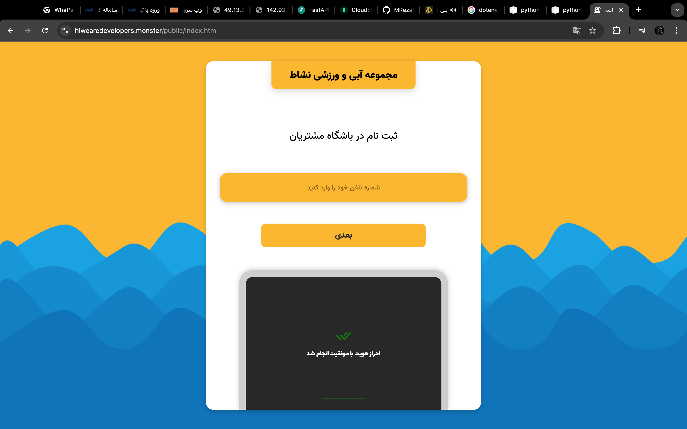
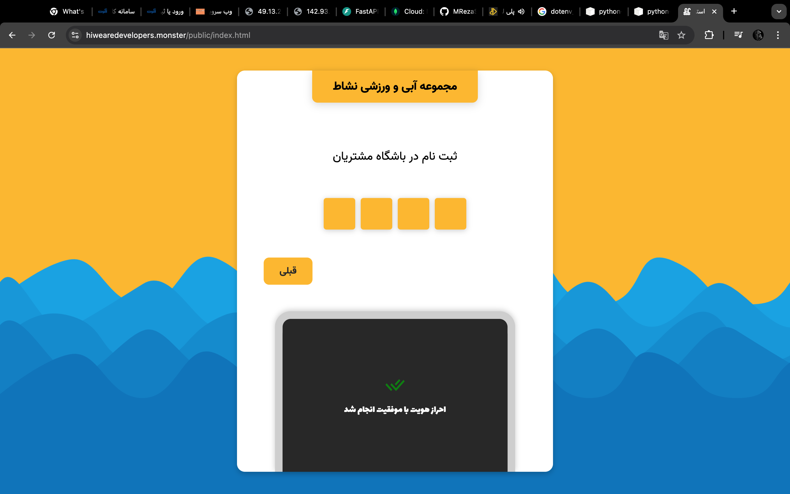
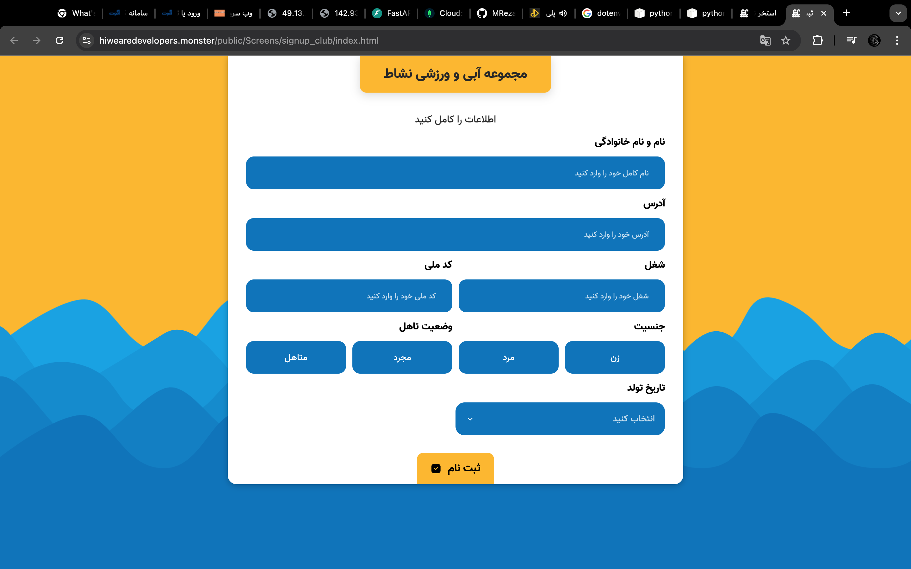

# Online Customer Club

This is a simple web-based **Customer Club Application** where customers can register by filling out a form, and administrators can manage customer data via an admin panel. Through the admin interface, admins can assign points to users, and offer rewards such as gifts. The backend of this project is developed using **FastAPI** and the frontend is built using **HTML**, **CSS**, and **JavaScript**.

## Features

- Customers can sign up by filling in their personal information.
- Customers receive points and rewards based on their engagement.
- Admin panel for managing customer data and assigning points or gifts.
- Secure and clean code with a FastAPI backend.
- Responsive and modern design for an improved user experience.

## Screenshots

### 1. Registration - Enter Phone Number

### 2. OTP Verification

### 3. Complete Registration Form

## Tech Stack

- **Backend**: [FastAPI](https://fastapi.tiangolo.com/)
- **Frontend**: HTML, CSS, JavaScript
- **Database**: mongoDB
- **Other Tools**: Git, systemCTL.

#

#

# Contact Developers

### fornt-end developer:

- Github --> [Subhaan Yaghouti](https://github.com/S-Yaghouti)
- Instagram ---> [Subhaan Yaghouti Instagram](https://www.instagram.com/subhaan_yaghouti?igsh=bmE3ZTl1bGkwaW50)

### back-end developer:

- Gmail ---> Rezasepehrs33@gmail.com
- Telegram_ID --> @MRezaSepehr
